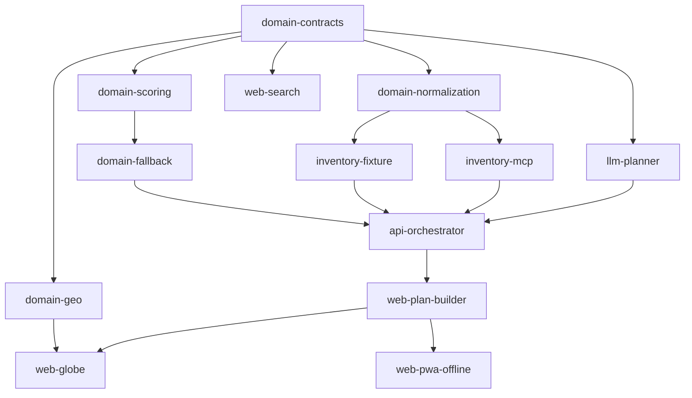

# Capability Map: «ТуТу План Б»

**Статус:** Approved
**Дата:** 2026-08-19
**Источник требований:** `docs/TUTU_PLAN_B_SYSTEM_DESIGN.md`

Инициатива объединяет несколько независимо тестируемых capability, поэтому границы модулей
и порядок сборки фиксируются здесь до написания module-специфичных требований.
Идентификаторы модулей стабильны и не переименовываются внутри инициативы.

## Модули

| Module id | Ответственность | Зависит от |
|---|---|---|
| `domain-contracts` | Zod-схемы и типы `TravelRequest`, `RoutePlan`, `CandidateOption`, `ScoreBreakdown`, `EvidenceRef`, `FallbackPlan`. Единственный источник истины по доменным формам | — |
| `domain-geo` | Great-circle геометрия, обработка антимеридиана, `deriveRouteViewport`, camera modes | `domain-contracts` |
| `domain-normalization` | Raw inventory record → canonical `CandidateOption`; quarantine невалидных записей; provenance | `domain-contracts` |
| `domain-scoring` | Hard filters, взвешенный scoring с `confidence`, три preset, дедупликация конфигураций, пересчёт totals | `domain-contracts` |
| `domain-fallback` | Выбор уязвимых stages и построение bounded «План Б» | `domain-contracts`, `domain-scoring` |
| `inventory-fixture` | Детерминированный `FixtureInventoryGateway` и demo-сценарии | `domain-contracts`, `domain-normalization` |
| `inventory-mcp` | Live Tutu MCP клиент, discovery, capability snapshot, команда `mcp:inspect` | `domain-contracts`, `domain-normalization` |
| `llm-planner` | OpenAI-адаптер: `SearchPlan` и `ExplanationBlock` через Structured Outputs; deterministic fallback | `domain-contracts` |
| `api-orchestrator` | Fastify, бюджеты, фазы, NDJSON stream, TTL repository, selections/replan, security headers | все `domain-*`, `inventory-*`, `llm-planner` |
| `web-search` | Экран поиска: форма, Zod-валидация, чипы ограничений | `domain-contracts` |
| `web-plan-builder` | Timeline, stage cards, переключение альтернатив, «План Б», summary, bottom sheet | `domain-*`, `api-orchestrator` |
| `web-globe` | MapLibre lazy globe, adaptive camera, синхронизация selection, fallback-матрица | `domain-geo`, `web-plan-builder` |
| `web-pwa-offline` | Manifest, service worker, IndexedDB последнего плана, `/offline` read-only | `web-plan-builder` |

## Направление зависимостей



Циклов нет. Контракт между `api-orchestrator` и web-модулями живёт в `domain-contracts`
как provider-модуле: web и api импортируют одни и те же схемы, а не описывают формы дважды.

## Порядок сборки

```text
domain-contracts
→ domain-geo, domain-normalization
→ domain-scoring
→ domain-fallback
→ inventory-fixture
→ api-orchestrator
→ web-search
→ web-plan-builder
→ web-globe
→ llm-planner
→ inventory-mcp
→ web-pwa-offline
```

Соответствие этапам из §25 системного дизайна:

| Этап | Модули |
|---|---|
| M0 | `inventory-mcp` (только discovery spike), скелет monorepo |
| M1 | `domain-contracts`, `domain-normalization`, `domain-scoring`, `inventory-fixture`, `api-orchestrator`, `web-search` |
| M2 | `web-plan-builder`, `domain-geo`, `web-globe` |
| M3 | `llm-planner` |
| M4 | `inventory-mcp` (live adapter), `domain-fallback` |
| M5 | `web-pwa-offline` + hardening |

`domain-fallback` реализуется раньше M4 в детерминированном виде на fixture pool,
а в M4 получает доступ к дополнительному live-поиску.
